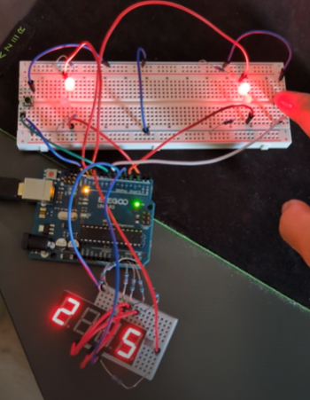

# Arduino Reaction Game 🔴⚪

Two players. One button each. React fast or lose.

## 🎮 Features
- White = press fast, Red = don't press!
- Score tracking with 7-segment display
- Random delay between rounds

## 🔧 Hardware Used
- Arduino UNO
- 2x Push Buttons
- 4x LEDs (2 white, 2 red)
- 7-Segment Display (common cathode)
- 7x 220Ω resistors (for the segments)
- Breadboards + jumper wires

## 🧠 Learning Goals
- `millis()` instead of `delay()`
- Multiplexing 7-segment displays
- State machines in `loop()`

## 📸 Demo

 
  
<em>👆 Click the image to watch the video 👆</em>

<em>🐔 sorry for the random german documentation 🐔 </em>

